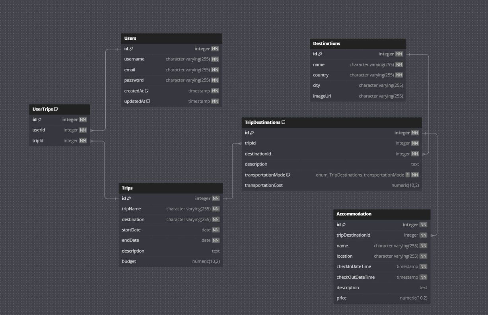

# My Travel Planner Project - Backend

This project is a backend application built with Node.js, Express, PostgreSQL, and Sequelize ORM.

## Table of Contents

- [Introduction](#introduction)
- [Features](#features)
- [Technologies](#technologies)
- [Getting Started](#getting-started)
- [Environment Variables](#environment-variables)
- [DB ERD](#db-erd)

## Introduction

This is a backend application designed to handle API requests, interact with a PostgreSQL database, and provide a robust foundation for building server-side applications. It uses Node.js and Express for server-side logic, PostgreSQL for the database, and Sequelize as the ORM for database interaction.

## Features

## Technologies

- **Node.js**
- **Express**
- **PostgreSQL**
- **Sequelize ORM**

## Getting Started

To get started with this project, follow these steps:

1. **Clone the repository**:

   git clone https://github.com/RIoToid/Travel-Planner-App.git
   cd ./backend

2. **Install Dependencies**:

   npm install

3. **Set up PostgreSQL**:

   - Ensure you have PostgreSQL installed and running.
   - Create a new database for the project.

4. **Configure environment variables**:

   Create a .env file in the root of the project and add the following variables:
   DB_HOST=localhost
   DB_USER=your_db_user
   DB_PASSWORD=your_db_password
   DB_NAME=your_db_name
   DB_PORT=5432
   EXPRESS_SERVER_PORT=3000

5. **Start the development server**:

   node server.js

## Environment Variables

The application uses the following environment variables, which should be defined in a .env file in the root directory:

- DB_HOST: The hostname of the PostgreSQL database.
- DB_USER: The username to connect to the PostgreSQL database.
- DB_PASSWORD: The password to connect to the PostgreSQL database.
- DB_NAME: The name of the PostgreSQL database.
- DB_PORT: The port number of the PostgreSQL database (default: 5432).
- EXPRESS_SERVER_PORT: The port number of the express API server.

## DB ERD

Link to the ERD on dbdiagram.io: https://dbdiagram.io/d/Travel_Planner_db_ERD-666ea99ea179551be6fda588